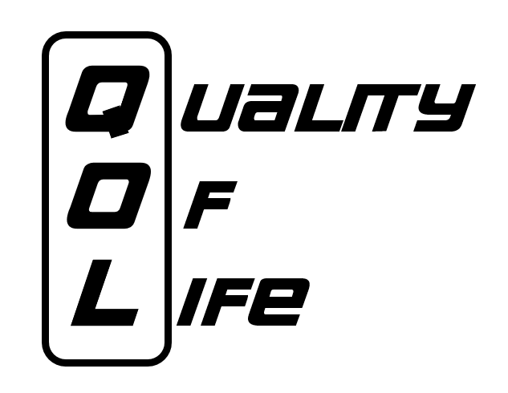



# 성균관대학교 컴퓨터교육과 QOL

============
웹사이트 : 
http://comedu.co.kr
혹은
http://comedu.skku.edu
혹은
http://comedu.skku.ac.kr

Made with XpressEngine

다음은 XE core를 기반으로 구현된 성균관대학교 컴퓨터교육과 홈페이지 소스코드입니다.

## QOL 상시 업무

* 홈페이지 컨텐츠 관리
* 조직도 세부 레이아웃
* 수강후기 게시판 개발
* 수강후기 DB 설계

## 진행 예정 프로젝트

* 모바일 레이아웃 변경
* 예약 시스템 보완, 수정

## 진행 중 프로젝트

* 졸업요건 계산기 자바스크립트 구현
* 클라이언트 보완

## 진행완료 프로젝트

* 실습실, 세미나실 예약 프로그램 제작
* https 전환
* 로고 제작

### +) 추가기능 구현

추가기능은 주로 PHP로 XE코어와 호환되는 방식으로 구현하였으며, 해당 프로젝트들은 /qol 폴더에 있습니다.

추후 프로젝트는 nodejs를 사용할 가능성도 열어두고 있습니다.
